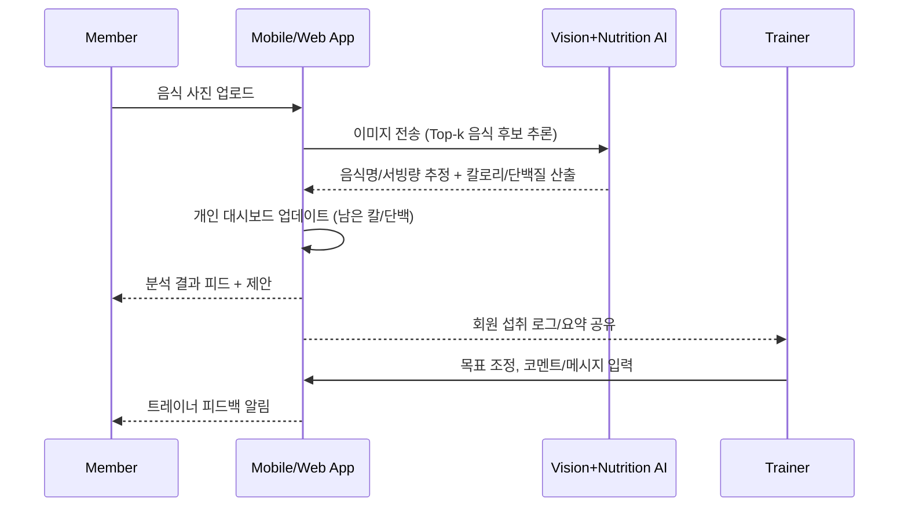

# code-for-all

# AI Trainer × Nutrition App

> 사진 기반 영양분석 + 트레이너 협업형 헬스케어 앱 (MVP)

## 0) TL;DR

* **회원**: 음식 사진 업로드 → **AI**가 칼로리/단백질 추정 → "오늘 남은 칼로리/단백질" 자동 계산.
* **AI**: 음식 인식 + 영양소 계산 → 개인 맞춤 대시보드 업데이트.
* **트레이너**: 목표(칼로리·단백질) 설정 및 피드백 → 채팅/코멘트로 회원 지도.
* **차별화**: 개인 기록형이 아닌 **트레이너-회원- AI 3자 협업** 중심.

---

## 1) 핵심 컨셉 (Product Concept)

* 회원: 음식 사진 업로드 → AI가 자동으로 **칼로리/단백질** 분석 → "**오늘 남은 칼로리/단백질**" 자동 계산.
* AI: 음식 **인식** + **영양소 계산** → **개인 맞춤형 대시보드** 업데이트.
* 트레이너: AI 분석 결과 바탕으로 **피드백 제공** (회원별 **칼로리/단백질 목표** 직접 설정 가능).

### 사용 흐름 (사용자 여정)

---

## 2) 영양소 데이터베이스 (Nutrition Data)

* 글로벌: **USDA**, **FatSecret**, **(선택) Edamam** 등 API 연동.
* 한국 음식: **식약처 식품영양성분 DB** 연동 (한식 카테고리 확충, 레시피 기반 가공식 분석 규칙 적용).
* 매핑 전략:

  * Vision 결과(음식명, 후보 리스트) → **정규화 사전**(KOR/ENG 동의어) → DB 키 매칭.
  * 서빙량 추정(접시/용기 스케일링) → **그램 환산** → 1회 제공량 기준 영양소 재계산.

> **정확도 정책**: "AI 추정값 ± 신뢰구간"을 표기하고, 회원/트레이너가

