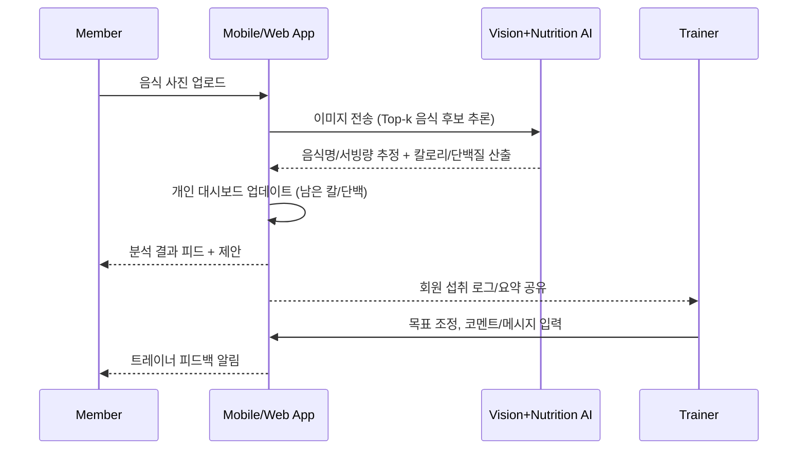

# code-for-all

# AI Trainer × Nutrition App

> 사진 기반 영양분석 + 트레이너 협업형 헬스케어 앱 (MVP)

## 0) TL;DR

* **회원**: 음식 사진 업로드 → **AI**가 칼로리/단백질 추정 → "오늘 남은 칼로리/단백질" 자동 계산.
* **AI**: 음식 인식 + 영양소 계산 → 개인 맞춤 대시보드 업데이트.
* **트레이너**: 목표(칼로리·단백질) 설정 및 피드백 → 채팅/코멘트로 회원 지도.
* **차별화**: 개인 기록형이 아닌 **트레이너-회원- AI 3자 협업** 중심.

---

## 1) 핵심 컨셉 (Product Concept)

* 회원: 음식 사진 업로드 → AI가 자동으로 **칼로리/단백질** 분석 → "**오늘 남은 칼로리/단백질**" 자동 계산.
* AI: 음식 **인식** + **영양소 계산** → **개인 맞춤형 대시보드** 업데이트.
* 트레이너: AI 분석 결과 바탕으로 **피드백 제공** (회원별 **칼로리/단백질 목표** 직접 설정 가능).
// pages/index.jsx (Next.js 예시)
import React from "react";

export default function Home() {
  return (
    <main style={{ fontFamily: "sans-serif", background: "#f7f8fa", minHeight: "100vh" }}>
      <header style={{ background: "#3b82f6", color: "#fff", padding: "2rem 0", textAlign: "center" }}>
        <h1 style={{ fontSize: "2.5rem", margin: 0 }}>AI 트레이너 × 영양분석 헬스케어</h1>
        <p style={{ fontSize: "1.2rem", marginTop: "0.5rem" }}>
          사진 한 장으로 영양분석, 트레이너와 실시간 소통!
        </p>
      </header>
      <section style={{ maxWidth: 900, margin: "2rem auto", background: "#fff", borderRadius: 16, boxShadow: "0 2px 8px #0001", padding: "2rem" }}>
        <h2 style={{ color: "#3b82f6" }}>앱 특징</h2>
        <ul style={{ fontSize: "1.1rem", lineHeight: 2 }}>
          <li>
            <b>사진 업로드</b>만 하면 <b>AI가 음식 인식·칼로리·단백질 자동 분석</b>
          </li>
          <li>
            <b>트레이너와 카톡처럼 채팅</b>하며 목표 설정·피드백·코멘트
          </li>
          <li>
            <b>개인 맞춤 대시보드</b>로 오늘 남은 칼로리/단백질 실시간 확인
          </li>
          <li>
            <b>회원-트레이너-AI 3자 협업</b>으로 책임감·동기부여 강화
          </li>
          <li>
            <b>글로벌/한식 영양DB</b> 연동, 신뢰도·오차 범위 표시
          </li>
          <li>
            <b>보안 강화</b>: 이미지·건강정보 암호화, 권한 분리
          </li>
        </ul>
        <div style={{ margin: "2rem 0", display: "flex", gap: "2rem", flexWrap: "wrap", justifyContent: "center" }}>
          <div style={{ flex: "1 1 300px", background: "#f0f4ff", borderRadius: 12, padding: "1.5rem" }}>
            <h3 style={{ color: "#2563eb" }}>회원</h3>
            <p>음식 사진 업로드 → AI 분석 결과 확인 → 트레이너와 소통</p>
          </div>
          <div style={{ flex: "1 1 300px", background: "#f0f4ff", borderRadius: 12, padding: "1.5rem" }}>
            <h3 style={{ color: "#2563eb" }}>AI</h3>
            <p>음식 인식, 영양소 계산, 신뢰도 표시, 대시보드 자동 업데이트</p>
          </div>
          <div style={{ flex: "1 1 300px", background: "#f0f4ff", borderRadius: 12, padding: "1.5rem" }}>
            <h3 style={{ color: "#2563eb" }}>트레이너</h3>
            <p>목표 설정, 피드백·코멘트, 회원별 맞춤 관리</p>
          </div>
        </div>
        <div style={{ margin: "2rem 0", textAlign: "center" }}>
          
          <p style={{ color: "#555", marginTop: "1rem" }}>음식 사진을 보내면 AI가 자동 분석! <br />트레이너와 실시간 피드백</p>
        </div>
        <div style={{ marginTop: "2rem", textAlign: "center" }}>
          <a href="#demo" style={{ background: "#3b82f6", color: "#fff", padding: "1rem 2rem", borderRadius: 8, fontSize: "1.2rem", textDecoration: "none" }}>
            데모 보러가기
          </a>
        </div>
      </section>
      <footer style={{ textAlign: "center", color: "#888", padding: "2rem 0" }}>
        &copy; 2025 YourCompany. Contact: product@yourcompany.com
      </footer>
    </main>
  );
}

### 사용 흐름 (사용자 여정)



---

## 2) 영양소 데이터베이스 (Nutrition Data)

* 글로벌: **USDA**, **FatSecret**, **(선택) Edamam** 등 API 연동.
* 한국 음식: **식약처 식품영양성분 DB** 연동 (한식 카테고리 확충, 레시피 기반 가공식 분석 규칙 적용).
* 매핑 전략:

  * Vision 결과(음식명, 후보 리스트) → **정규화 사전**(KOR/ENG 동의어) → DB 키 매칭.
  * 서빙량 추정(접시/용기 스케일링) → **그램 환산** → 1회 제공량 기준 영양소 재계산.

> **정확도 정책**: "AI 추정값 ± 신뢰구간"을 표기하고, 회원/트레이너가 수동 보정 시 **학습 피드백**으로 반영.

---

## 3) 개인 맞춤 대시보드 (Personalized Dashboard)

* 트레이너가 회원별 **칼로리/단백질** **목표치** 설정 (일일 또는 주간).
* 회원이 음식 섭취 시 자동으로 **남은 칼로리/단백질** 업데이트.
* 보조 지표: PFC(탄/단/지) 분포, 수분, 섬유소, 나트륨 경고 등.
* 알림: 목표 대비 과부족 시 푸시/배지.

### 남은 칼로리/단백질 계산 로직 (예시)

```
remaining_cal = daily_target_cal - sum(consumed_cal_today)
remaining_pro = daily_target_pro - sum(consumed_pro_today)
```

* **경계 조건**: 음수(초과) 시 적색 경고, 다음 끼니 가이드 제안.

---

## 4) 트레이너 ↔ 회원 협업 기능 (Collaboration)

* **채팅 기반 인터페이스**: 사진, AI 결과 카드, 트레이너 코멘트가 **한 화면**에 스레드로 묶임.
* **목표 관리**: 트레이너가 실시간 목표치 수정, 요일별 전략(훈련일/휴식일) 템플릿.
* **요약 리포트**: 일/주간 섭취 요약, Top 과다/부족 영양소, 개선 제안 3가지.

---

## 5) 차별화 포인트 (Differentiators)

* 개인 기록형이 아닌 **코칭 협업** 중심: **책임성(Accountability)** 강화.
* **자동 기록**(사진 → AI)로 입력 부담 최소화.
* **인간 코칭 + 자동화**의 하이브리드: 정량 분석과 맞춤 피드백의 결합.

---

## 6) 아키텍처 개요 (Architecture)

```mermaid
flowchart LR
  A[Mobile/Web Client] --upload--> B[API Gateway]
  B --> C[Auth Service]
  B --> D[Image Ingest]
  D --> E[Vision Inference]
  E --> F[Food Canonicalizer]
  F --> G[Nutrition DB Adapter\n(USDA/FatSecret/식약처)]
  G --> H[Nutrition Engine\n(서빙량/가중치/오차)]
  H --> I[Intake Ledger]
  I --> J[Personal Dashboard]
  J --> K[Trainer Console]
  B --> L[Chat/Comments Service]
  subgraph Data Stores
    I
    M[(User/Trainer/Targets)]
    N[(Media Storage)]
  end
```

### 기술 스택(예시)

* **Frontend**: React/Next.js (Web), React Native/Flutter (Mobile)
* **Backend**: Node.js/Express or NestJS (또는 Python/FastAPI)
* **AI**: PyTorch/ONNX + Serving (TorchServe/TF Serving), OpenCV, YOLO/ViT 계열
* **DB**: PostgreSQL (거래/관계), Redis (캐시), S3/GCS (이미지)
* **Infra**: Docker, K8s, CI/CD(GitHub Actions), IaC(Terraform)

---

## 7) API 설계 스케치 (Draft)

### Auth

```http
POST /auth/signup
POST /auth/login
POST /auth/invite-trainer  # 트레이너 초대/연결
```

### 음식 분석 & 기록

```http
POST /intake/analyze-image
  - multipart: image
  - response: { items: [{name, confidence, grams, kcal, protein_g, source}], totals: {kcal, protein_g}, editable: true }

POST /intake/confirm
  - body: { items: [...], meal_time }

GET /intake/summary?date=YYYY-MM-DD
  - response: { totals: {kcal, protein_g, ...}, remaining: {kcal, protein_g} }
```

### 목표/대시보드

```http
GET /targets
POST /targets
  - body: { daily_cal, daily_protein, template?: "bulk"|"cut"|"rest" }
```

### 협업/채팅

```http
GET /threads/:memberId
POST /threads/:memberId/messages
  - body: { text?, attachmentId?, analysisRef? }
```

---

## 8) 데이터 모델 (간단 ERD)

```mermaid
erDiagram
  USER ||--o{ MEMBER : has
  USER ||--o{ TRAINER : has
  TRAINER ||--o{ RELATION : manages
  MEMBER ||--o{ INTAKE : logs
  MEMBER ||--o{ TARGET : sets

  USER { string id PK }
  MEMBER { string id PK, userId FK }
  TRAINER { string id PK, userId FK }
  RELATION { string id PK, memberId FK, trainerId FK, status }
  TARGET { string id PK, memberId FK, daily_cal int, daily_protein int, effective_from date }
  INTAKE { string id PK, memberId FK, ts datetime, kcal float, protein_g float, items jsonb }
```

---

## 9) AI 정확도/검증 정책

* **Top-k 후보 + 신뢰도** 제공, 사용자가 수정 시 가중치 재학습(피드백 루프).
* **서빙량 추정**: 접시/손/용기 스케일링, 거리/깊이 휴리스틱, 추정 오류 범위 노출.
* **품질지표**: MAPE\@kcal, MAE\@protein, 사용자 수정율, 트레이너 승인율.

---

## 10) 보안/개인정보 (필수)

* **이미지/건강정보**는 민감정보로 취급: 전송 **TLS**, 저장 **암호화(At-Rest)**.
* **권한 분리**: 회원↔트레이너 연결 기반 최소권한 부여.
* **감사로그**: 목표 변경, 수동수정 이력 추적.
* **보존정책**: 탈퇴 시 전량 삭제, 익명화 통계는 별도 보관.

---

## 11) MVP 범위 (Phase 0\~1)

* P0: 회원 가입/로그인, 사진 업로드, AI 1차 분석(Top-1), 대시보드(남은 칼/단백), 트레이너 연결, 코멘트.
* P1: Top-k 후보, 수동 편집, 목표 템플릿, 주간 리포트, 식약처/USDA 병합 매핑.

### 비범위 (Out of Scope, 초기)

* 완전한 레시피 생성/외식 추천, 자동 장보기, 웨어러블 통합(후순위).

---

## 12) 환경 변수 예시 (.env)

```
APP_ENV=dev
DB_URL=postgres://...
STORAGE_BUCKET=s3://...
VISION_ENDPOINT=https://...
USDA_API_KEY=...
FATSECRET_CLIENT_ID=...
FATSECRET_CLIENT_SECRET=...
MFDS_API_KEY=...
JWT_SECRET=...
```

---

## 13) 로컬 개발 (예시)

```bash
# 1) 서버 부팅
pnpm i && pnpm dev
# 2) 프론트엔드
cd app && pnpm dev
# 3) AI 서빙(로컬)
python serve.py  # /analyze 엔드포인트 제공
```

---

## 14) 품질/운영

* 로깅/모니터링: OpenTelemetry + Grafana.
* 에러 정책: 분석 실패 시 수동 입력 플로우 제공.
* A/B 테스트: 목표 제안 문구/알림 빈도 실험.

---

## 15) 라이선스 & 연락처

* © 2025 YourCompany. All rights reserved.
* Contact: [product@yourcompany.com](mailto:product@yourcompany.com)
